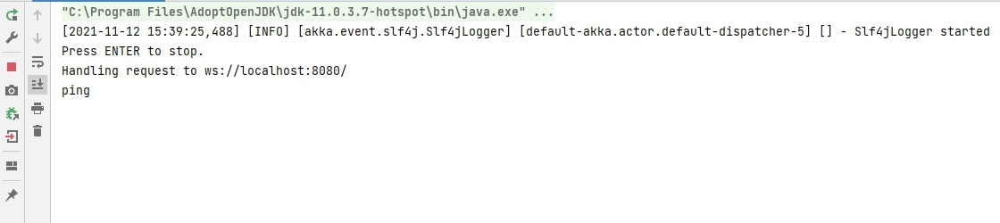

# Simple Websocket client & server
The simple Websocket server &amp; client applications.

## Server
- Java
- Akka HTTP
- IntelliJ

## Client
- JavaScript
- NodeJS
- ws
- Visual Studio Code

## Usage
- Compile the server project in the ```server``` folder first.
- Run the client project in the ```client``` folder.
- In the console of the ```server``` project, the sending message should appear like this:



- In the console of the ```client``` project, the receiving message should show as follows:


